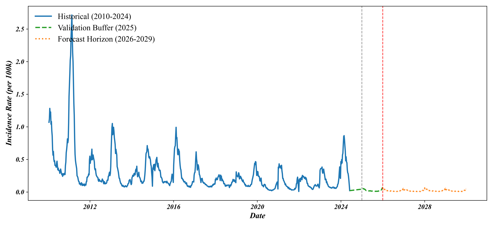
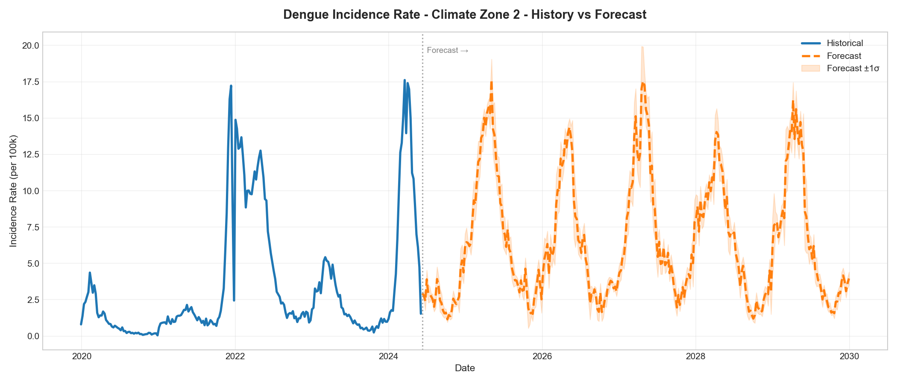
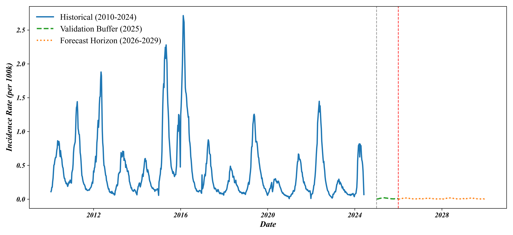

# Dengue Brazil: Climate-Driven Epidemiological Forecasting

A production-grade, memory-optimized machine learning framework for forecasting **municipality-level dengue incidence** across Brazil using **LightGBM** and climate-driven predictors.

The framework performs:

- Municipality-level climate forecasting
- Municipality-level dengue prediction
- Aggregation into six Brazilian climate zones
- Five-year epidemiological forecasting
- Interactive spatial visualization
- Publication-quality figures

---

# Overview

The project consists of two independent forecasting pipelines:

1. **Climate Forecasting**
   - Predicts future weekly climate variables for every municipality.

2. **Dengue Forecasting**
   - Uses predicted climate variables to estimate future dengue incidence.

The final outputs are aggregated into six climate zones for visualization while preserving municipality-level prediction throughout the modeling process.

---

# Project Workflow

```
Historical Municipality Climate Data (2010–2024)
                    │
                    ▼
        Climate Feature Engineering
                    │
                    ▼
     LightGBM Climate Forecast Models
                    │
                    ▼
 Future Municipality Climate (2025–2030)
                    │
                    ▼
        Dengue Feature Engineering
                    │
                    ▼
      LightGBM Dengue Prediction
                    │
                    ▼
 Municipality-Level Dengue Forecast
                    │
                    ▼
 Aggregation into Six Climate Zones
                    │
                    ▼
 Graphs • Maps • Publication Figures
```

---

# Climate Zones

| Zone | Region |
|-------|--------|
| Zone 1 | Equatorial Amazon |
| Zone 2 | Cerrado North |
| Zone 3 | Semi-Arid Northeast |
| Zone 4 | Central-West |
| Zone 5 | Southeast Core |
| Zone 6 | Southern Temperate |

---

# Dengue Forecast Curves

Each graph contains three sections.

| Section | Line Style | Period |
|----------|------------|---------|
| Historical | Solid Blue | 2018 – June 2024 |
| Validation Buffer | Dashed Green | June 2024 – December 2025 |
| Forecast | Dotted Orange (+/-1σ Confidence Band) | 2026 – 2030 |

---

## Zone 1 – Equatorial Amazon

States

```
AC
AM
AP
PA
RO
RR
```



---

## Zone 2 – Cerrado North

States

```
MA
TO
```



---

## Zone 3 – Semi-Arid Northeast

States

```
AL
CE
PB
PE
PI
RN
SE
```



---

## Zone 4 – Central-West

States

```
BA
DF
GO
MS
MT
```

---

## Zone 5 – Southeast Core

States

```
ES
MG
RJ
SP
```

---

## Zone 6 – Southern Temperate

States

```
PR
RS
SC
```

---

# Validation Summary (2025 Buffer)

| Climate Zone | Actual | Predicted | Relative Error |
|--------------|--------|-----------|---------------|
| Zone 1 | 36,800 | 36,594 | <1% |
| Zone 2 | 8,980 | 9,026 | <1% |
| Zone 3 | 64,393 | 63,882 | <1% |
| Zone 4 | 195,110 | 201,251 | 3.1% |
| Zone 5 | 1,132,300 | 1,174,884 | 3.8% |
| Zone 6 | 222,167 | 222,513 | 0.2% |
| **Brazil** | **1,660,186** | **1,708,150** | **2.89%** |

---

# Peak Forecast Incidence (per 100,000 Population)

| Zone | 2026 | 2027 | 2028 | 2029 | 2030 |
|------|------|------|------|------|------|
| Zone 1 | 9.2 | ~11 | 16.4 | 5.2 | 8.2 |
| Zone 2 | 14.4 | ~17 | 19.5 | 10.1 | 4.8 |
| Zone 3 | 12.8 | ~20 | 33.7 | 10.3 | 18.6 |
| Zone 4 | 29.5 | ~33 | 43.2 | 31.5 | 20.0 |
| Zone 5 | 17.1 | ~21 | 24.7 | 29.9 | 22.2 |
| Zone 6 | 30.8 | ~38 | 68.6 | 45.6 | 64.6 |

---

# Directory Structure

```
Dengue_Brazil/
│
├── climate/
│   │
│   ├── train_climate.py
│   ├── predict_climate.py
│   │
│   ├── models/
│   │
│   └── outputs/
│       ├── csv/
│       ├── graphs/
│       ├── metrics/
│       └── feature_importance/
│
├── dengue/
│   │
│   ├── train_dengue.py
│   ├── predict_dengue.py
│   ├── predict_dengue_2years.py
│   │
│   ├── models/
│   │
│   └── outputs/
│       ├── csv/
│       ├── graphs/
│       ├── metrics/
│       └── feature_importance/
│
├── data/
│   │
│   ├── final_brazil_municipality.csv
│   ├── final_brazil_dengue.csv
│   ├── municipios_coords.csv
│   └── brazil_states.geojson
│
├── final/
│   │
│   ├── generate_visualizations.py
│   ├── generate_visualizations_2years.py
│   │
│   ├── outputs/
│   │   ├── graphs/
│   │   ├── maps/
│   │   ├── csv/
│   │   └── metrics/
│   │
│   └── outputs_2years/
│       ├── graphs/
│       ├── maps/
│       ├── csv/
│       └── metrics/
│
├── run.py
├── requirements.txt
├── README.md
└── LICENSE
```

---

# Running the Pipeline

## Install Dependencies

```bash
pip install -r requirements.txt
```

---

## Run Complete Pipeline

```bash
python run.py --all
```

---

## Train Climate Models

```bash
python run.py --train-climate
```

---

## Train Dengue Models

```bash
python run.py --train-dengue
```

---

## Generate Five-Year Forecast

```bash
python run.py --forecast-5years
```

---

## Generate Two-Year Forecast

```bash
python run.py --forecast-2years
```

---

# Machine Learning Models

## Climate Forecasting

- Algorithm: LightGBM
- Spatial Resolution: Municipality
- Temporal Resolution: Weekly
- Training Period: 2010–2021
- Validation: 2022–2024
- Forecast: 2025–2030

Predicted Variables

- Minimum Temperature
- Mean Temperature
- Maximum Temperature
- Mean Precipitation
- Total Precipitation
- Atmospheric Pressure
- Relative Humidity
- Thermal Range
- Rainy Days

---

## Dengue Forecasting

Algorithm

LightGBM

Target

Weekly Dengue Incidence Rate

Features

- Historical Incidence
- Climate Variables
- Population
- Seasonal Features
- Epidemiological Week
- Lag Variables
- Rolling Statistics

---

# Output Products

The framework automatically generates:

- Municipality-level climate forecasts
- Municipality-level dengue forecasts
- Zone-level aggregated forecasts
- Validation metrics
- Feature importance plots
- Publication-quality figures (600 DPI PNG & EPS)
- Interactive HTML choropleth maps
- Forecast CSV files

---

# Software Requirements

- Python 3.10+
- LightGBM
- Pandas
- NumPy
- Scikit-learn
- Matplotlib
- GeoPandas
- Plotly
- Joblib

---

# License

This project is intended for academic research and educational purposes.