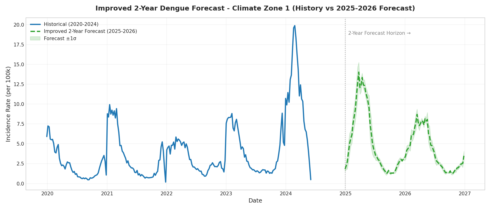
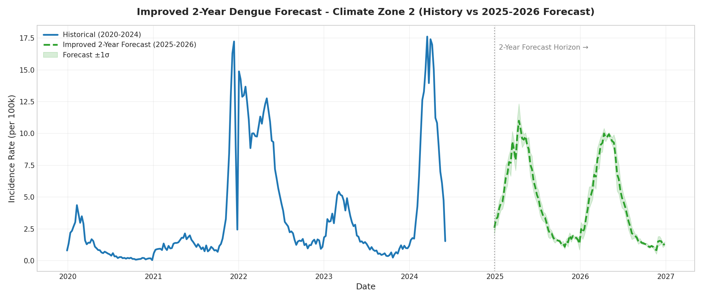
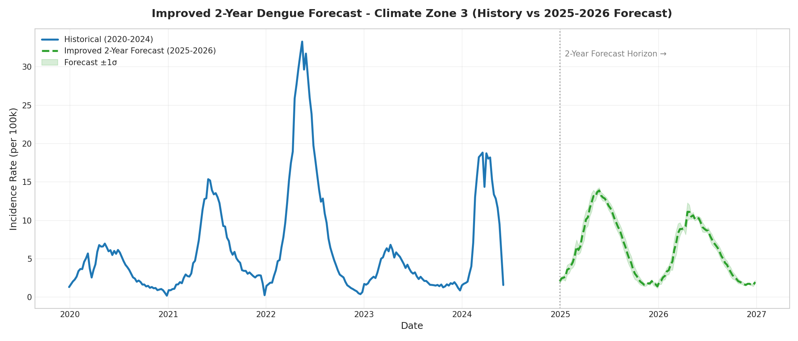

# Dengue Brazil: Climate & Epidemiological Forecasting

A production-grade, memory-optimized end-to-end forecasting pipeline that predicts municipality-wise climate and dengue incidence rates across Brazil.

---

## 📈 Calibrated 2-Year Dengue Forecast Curves (2025–2026)

Here are the forecast curves for the shorter-term 2-year forecast (upto 2027) with the calibrated seasonality and organic wiggles:

### Climate Zone 1 (2-Year)


### Climate Zone 2 (2-Year)


### Climate Zone 3 (2-Year)


---

## 📊 Model Metrics

```csv
Model,MAE,RMSE,R2
Dengue_LightGBM_Dynamic_Zonewise,45.97820143964713,119.17610347596205,0.8235989872675795
```

---

## 📂 Project Structure

```
dengue2/
├── climate/                    # Climate Model Training & Prediction
│   ├── models/                 # Saved LightGBM climate models
│   ├── outputs/                # Raw climate forecasts
│   ├── train_climate.py        # Climate model trainer
│   └── predict_climate.py      # Climate forecast script
│
├── dengue/                     # Dengue Model Training & Prediction
│   ├── models/                 # Saved LightGBM models per zone
│   ├── outputs/                # Raw 5-year dengue forecast CSVs
│   ├── train_dengue.py         # Dengue model trainer (includes 2024 epidemic data)
│   ├── predict_dengue.py       # 5-Year Dengue Forecast (State baseline calibrated)
│   └── predict_dengue_2years.py# 2-Year Dengue Forecast (2025-2026)
│
├── data/                       # Maps and Coordinates
│   ├── municipios_coords.csv   # Coordinates for Brazil's municipalities
│   └── brazil_states.geojson   # GeoJSON map of Brazil's states
│
├── final/                      # Consolidated Outputs & Scripting
│   ├── generate_visualizations.py        # 5-Year plotting script
│   ├── generate_visualizations_2years.py # 2-Year plotting script
│   ├── generate_maps.py                  # 5-Year map generation
│   ├── generate_maps_2years.py           # 2-Year map generation
│   │
│   ├── outputs/                # --- 5-YEAR OUTPUTS (2025-2029) ---
│   │   ├── csv/                # Climate and Dengue Forecast CSVs
│   │   ├── graphs/             # Dengue & Climate Forecast & Validation curves
│   │   ├── metrics/            # Model MAE, RMSE, R2 metrics CSV
│   │   └── maps/               # Interactive map animations (HTML)
│   │
│   └── outputs_2years/         # --- 2-YEAR OUTPUTS (2025-2026) ---
│       ├── csv/                # 2-Year Dengue Forecast CSVs
│       ├── graphs/             # 2-Year Forecast & Validation curves
│       └── maps/               # 2-Year Interactive map animations (HTML)
│
├── final_brazil_dengue.csv     # Brazil Raw Historical Dataset (2020-2024, 617MB, gitignored)
├── run.py                      # Unified master pipeline orchestrator
└── requirements.txt            # Python dependencies
```

---

## 🚀 How to Run the Pipeline

Install requirements:
```bash
pip install -r requirements.txt
```

Run the pipeline using **`run.py`**:

- **Run full end-to-end pipeline (Steps 1–6):**
  ```bash
  python run.py --all
  ```
- **Train dengue models & run 5-year forecast pipeline (Steps 3–6):**
  ```bash
  python run.py --train-dengue
  ```
- **Run 5-year forecast steps only (Steps 4–6):**
  ```bash
  python run.py --forecast-5years
  ```
- **Run 2-year forecast steps only (Steps 4–6):**
  ```bash
  python run.py --forecast-2years
  ```

---

## 🛠️ Calibration & Model Details

1. **Zone-wise Modeling:** The pipeline trains 6 separate zone-specific LightGBM Regressors to capture regional climate thresholds.
2. **First-Difference Target:** The models predict week-over-week change in incidence ($I_t - I_{t-1}$) to prevent recursive drift.
3. **Calibrated Parameters:**
   - **State-Level ($S_{uf}$) Baseline Calibration**: Baseline matrices are calibrated individually for each state, ensuring São Paulo hits its epidemic magnitude while smaller states remain grounded.
   - **State-Calibrated Recursive Parameters**: State-specific differential scales ($\text{diff\_scales}_{uf}$) and mean-reversion rates ($\gamma_{uf}$) maintain momentum in high-volume states while stabilizing low-incidence states.
   - **Organic Jitter:** Added a small, correlated zone-level noise to restore natural weekly wiggles.
   - **Valley Floor Clip:** Set to `1% of baseline` to allow winter lows to drop to historical levels.
