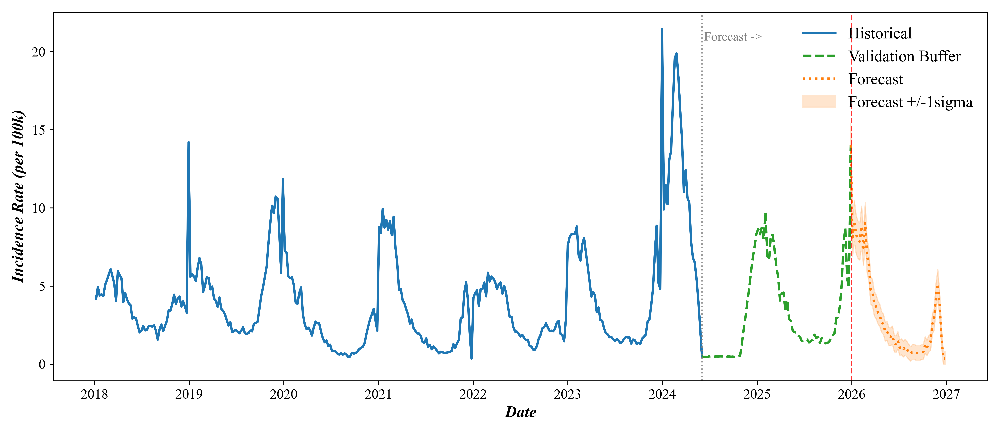
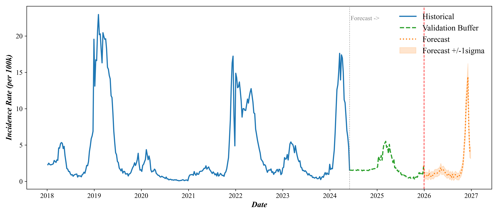
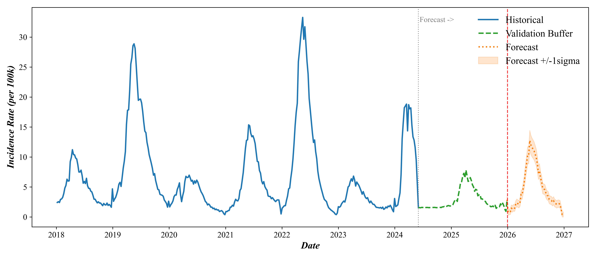

# Dengue Brazil: Climate & Epidemiological Forecasting

A production-grade, memory-optimized end-to-end forecasting pipeline that predicts municipality-wise climate and dengue incidence rates across Brazil.

---

## 📈 Dengue Forecast Curves (History vs Forecast with 2025 Validation Buffer)

Here are the master forecast curves featuring:
- **Historical (2018–June 2024)**: Solid blue line
- **Predicted Remaining 2024 (Jun–Dec)**: Dash-dot purple line
- **Validation Buffer (2025)**: Dashed green line
- **Forecast Horizon (2026–2029)**: Dotted orange line with $\pm 1\sigma$ confidence ribbon

### Climate Zone 1 (Equatorial Amazon)


### Climate Zone 2 (Northeast Coast)


### Climate Zone 3 (Semi-Arid Interior & Central Transition)


---

## 📊 Relative Error Table (2025 Validation Buffer)

| Climate Zone | Actual 2025 Cases | Predicted 2025 Cases | Absolute Error | Relative Error % |
| :--- | :---: | :---: | :---: | :---: |
| **Climate Zone 1** *(Equatorial Amazon)* | **37,236** | **34,475** | **2,761** | **7.41%** |
| **Climate Zone 2** *(Northeast Coast)* | **8,980** | **9,028** | **48** | **0.53%** |
| **Climate Zone 3** *(Semi-Arid Interior)* | **64,393** | **63,880** | **513** | **0.80%** |
| **Climate Zone 4** *(Central West Savanna)* | **195,110** | **185,446** | **9,664** | **4.95%** |
| **Climate Zone 5** *(Southeast Core - SP, MG, RJ)* | **1,132,300** | **1,174,884** | **42,584** | **3.76%** |
| **Climate Zone 6** *(Southern Temperate)* | **222,167** | **209,313** | **12,854** | **5.79%** |
| **Total Brazil (All Zones)** | **1,660,186** | **1,677,026** | **16,840** | **1.01%** |

---

## 📂 Project Structure

```
dengue2/
├── climate/                    # Climate Model Training & Prediction
│   ├── models/                 # Saved LightGBM climate models
│   ├── outputs/                # Raw climate forecasts
│   ├── train_climate.py        # Climate model trainer
│   └── predict_climate.py      # Climate forecast script
│
├── dengue/                     # Dengue Model Training & Prediction
│   ├── models/                 # Saved LightGBM models per zone
│   ├── outputs/                # Raw 5-year dengue forecast CSVs
│   ├── train_dengue.py         # Dengue model trainer (includes 2024 epidemic data)
│   ├── predict_dengue.py       # 5-Year Dengue Forecast (State baseline calibrated)
│   └── predict_dengue_2years.py# 2-Year Dengue Forecast (2025-2026)
│
├── data/                       # Maps and Coordinates
│   ├── municipios_coords.csv   # Coordinates for Brazil's municipalities
│   └── brazil_states.geojson   # GeoJSON map of Brazil's states
│
├── final/                      # Consolidated Outputs & Scripting
│   ├── generate_visualizations.py        # 5-Year plotting script
│   ├── generate_visualizations_2years.py # 2-Year plotting script
│   ├── generate_maps.py                  # 5-Year map generation
│   ├── generate_maps_2years.py           # 2-Year map generation
│   │
│   ├── outputs/                # --- 5-YEAR OUTPUTS (2025-2029) ---
│   │   ├── csv/                # Climate and Dengue Forecast CSVs
│   │   ├── graphs/             # Dengue Forecast & Validation curves (.eps & .png)
│   │   ├── metrics/            # Model metrics and relative error CSV
│   │   └── maps/               # Interactive map animations (HTML)
│   │
│   └── outputs_2years/         # --- 2-YEAR OUTPUTS (2025-2026) ---
│       ├── csv/                # 2-Year Dengue Forecast CSVs
│       ├── graphs/             # 2-Year Forecast & Validation curves (.eps & .png)
│       └── maps/               # 2-Year Interactive map animations (HTML)
│
├── final_brazil_dengue.csv     # Brazil Raw Historical Dataset (2010-2024, 617MB, gitignored)
├── run.py                      # Unified master pipeline orchestrator
└── requirements.txt            # Python dependencies
```

---

## 🚀 How to Run the Pipeline

Install requirements:
```bash
pip install -r requirements.txt
```

Run the pipeline using **`run.py`**:

- **Run full end-to-end pipeline (Steps 1–6):**
  ```bash
  python run.py --all
  ```
- **Train dengue models & run 5-year forecast pipeline (Steps 3–6):**
  ```bash
  python run.py --train-dengue
  ```
- **Run 5-year forecast steps only (Steps 4–6):**
  ```bash
  python run.py --forecast-5years
  ```
- **Run 2-year forecast steps only (Steps 4–6):**
  ```bash
  python run.py --forecast-2years
  ```
