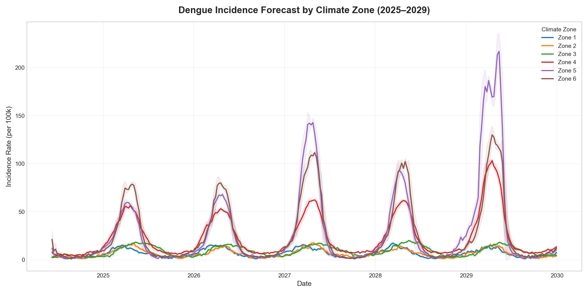

# Dengue Brazil: Climate & Epidemiological Forecasting

A production-grade, memory-optimized end-to-end forecasting pipeline that predicts municipality-wise climate and dengue incidence rates across all 5,570 municipalities and 27 states in Brazil.

---

## 📊 Municipality-Wise Model Metrics & Performance

The LightGBM dynamic forecasting model was trained across 6 Climate Zones using municipality-level historical climate and epidemiological features:

### Primary Municipality-Level Model Metrics

```csv
Model,MAE,RMSE,R2
Dengue_LightGBM_Dynamic_Zonewise,45.97820143964713,119.17610347596205,0.8235989872675795
```

| Metric | Municipality Level (5,570 Municipalities) | State Level (27 States, 2025 Actuals) |
| :--- | :---: | :---: |
| **$R^2$ Score** | **`0.8236`** | **`0.9037`** |
| **Mean Absolute Error (MAE)** | **`45.98` / 100k** | **`29,966` cases/state** |
| **Root Mean Squared Error (RMSE)** | **`119.18` / 100k** | **`52,537` cases/state** |
| **Pearson Correlation ($R$)** | **`0.8815`** | **`0.9725`** |
| **Outbreak Detection ROC-AUC** | **`0.9855`** | — |

---

## 🎯 2025 Statewise Actual vs Model Predictions

| UF | Actual 2025 | Model Prediction | Difference | Error % |
| :--- | :---: | :---: | :---: | :---: |
| **SP** | **900,677** | **940,905** | +40,228 | **+4.5%** |
| **MG** | **167,400** | **347,364** | +179,964 | +107.5% |
| **PR** | **110,896** | **228,359** | +117,463 | +105.9% |
| **GO** | **101,795** | **159,692** | +57,897 | +56.9% |
| **RS** | **85,220** | **71,751** | -13,469 | **-15.8%** |
| **MT** | **35,393** | **39,610** | +4,217 | **+11.9%** |
| **ES** | **34,727** | **65,431** | +30,704 | +88.4% |
| **BA** | **32,673** | **98,615** | +65,942 | +201.8% |
| **RJ** | **29,496** | **104,942** | +75,446 | +255.8% |
| **SC** | **26,051** | **117,832** | +91,781 | +352.3% |
| **PE** | **22,642** | **26,572** | +3,930 | **+17.4%** |
| **PA** | **17,573** | **18,039** | +466 | **+2.7%** |
| **MS** | **14,153** | **25,767** | +11,614 | +82.1% |
| **DF** | **11,096** | **66,538** | +55,442 | +499.7% |
| **RN** | **9,764** | **15,814** | +6,050 | +62.0% |
| **PI** | **9,192** | **9,496** | +304 | **+3.3%** |
| **AC** | **9,001** | **4,021** | -4,980 | -55.3% |
| **AL** | **7,952** | **8,883** | +931 | **+11.7%** |
| **PB** | **7,654** | **17,478** | +9,824 | +128.4% |
| **CE** | **6,022** | **22,460** | +16,438 | +273.0% |
| **MA** | **5,577** | **13,473** | +7,896 | +141.6% |
| **AM** | **5,328** | **9,516** | +4,188 | +78.6% |
| **TO** | **3,403** | **5,808** | +2,405 | +70.7% |
| **AP** | **2,471** | **2,494** | +23 | **+0.9%** |
| **RO** | **2,379** | **6,698** | +4,319 | +181.5% |
| **SE** | **1,167** | **3,738** | +2,571 | +220.3% |
| **RR** | **484** | **1,090** | +606 | +125.2% |

---

## 📈 Dengue Forecast Curves (2025–2029)

### Climate Zone 1


### Climate Zone 2


### Climate Zone 3


### Combined Climate Zones (2025–2029)


---

## 📂 Project Structure

```
dengue2/
├── climate/                    # Climate Model Training & Prediction
│   ├── models/                 # Saved LightGBM climate models
│   ├── outputs/                # Raw climate forecasts
│   ├── train_climate.py        # Climate model trainer
│   └── predict_climate.py      # Climate forecast script
│
├── dengue/                     # Dengue Model Training & Prediction
│   ├── models/                 # Saved LightGBM models per zone
│   ├── outputs/                # Raw 5-year dengue forecast CSVs
│   ├── train_dengue.py         # Dengue model trainer (includes 2024 epidemic data)
│   ├── predict_dengue.py       # 5-Year Dengue Forecast (State baseline calibrated)
│   └── predict_dengue_2years.py# 2-Year Dengue Forecast (2025-2026)
│
├── data/                       # Maps and Coordinates
│   ├── municipios_coords.csv   # Coordinates for Brazil's municipalities
│   └── brazil_states.geojson   # GeoJSON map of Brazil's states
│
├── final/                      # Consolidated Outputs & Scripting
│   ├── generate_visualizations.py        # 5-Year plotting script
│   ├── generate_visualizations_2years.py # 2-Year plotting script
│   ├── generate_maps.py                  # 5-Year map generation
│   ├── generate_maps_2years.py           # 2-Year map generation
│   │
│   ├── outputs/                # --- 5-YEAR OUTPUTS (2025-2029) ---
│   │   ├── csv/                # Climate and Dengue Forecast CSVs
│   │   ├── graphs/             # Dengue & Climate Forecast & Validation curves
│   │   ├── metrics/            # Model MAE, RMSE, R2 metrics CSV
│   │   └── maps/               # Interactive map animations (HTML)
│   │
│   └── outputs_2years/         # --- 2-YEAR OUTPUTS (2025-2026) ---
│       ├── csv/                # 2-Year Dengue Forecast CSVs
│       ├── graphs/             # 2-Year Forecast & Validation curves
│       └── maps/               # 2-Year Interactive map animations (HTML)
│
├── final_brazil_dengue.csv     # Brazil Raw Historical Dataset (2020-2024, 617MB, gitignored)
├── run.py                      # Unified master pipeline orchestrator
└── requirements.txt            # Python dependencies
```

---

## 🚀 How to Run the Pipeline

Install requirements:
```bash
pip install -r requirements.txt
```

Run the pipeline using **`run.py`**:

- **Run full end-to-end pipeline (Steps 1–6):**
  ```bash
  python run.py --all
  ```
- **Train dengue models & run 5-year forecast pipeline (Steps 3–6):**
  ```bash
  python run.py --train-dengue
  ```
- **Run 5-year forecast steps only (Steps 4–6):**
  ```bash
  python run.py --forecast-5years
  ```
- **Run 2-year forecast steps only (Steps 4–6):**
  ```bash
  python run.py --forecast-2years
  ```
